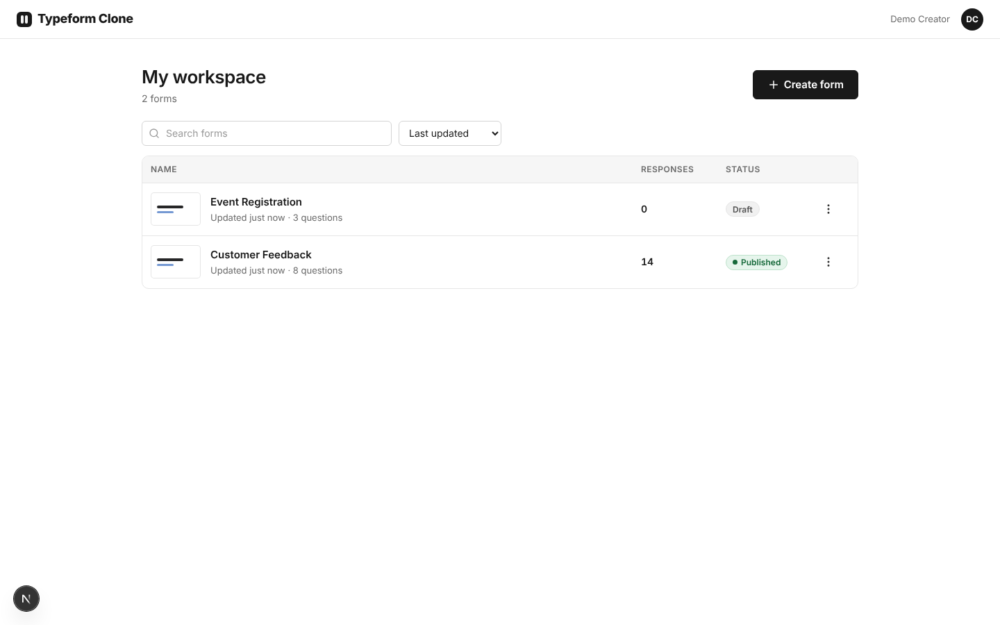
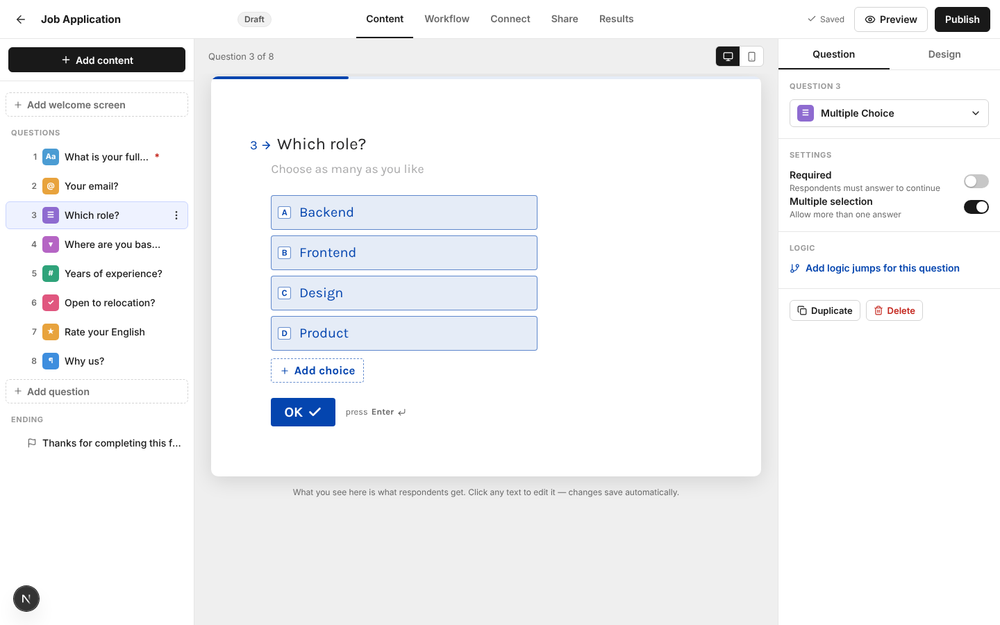
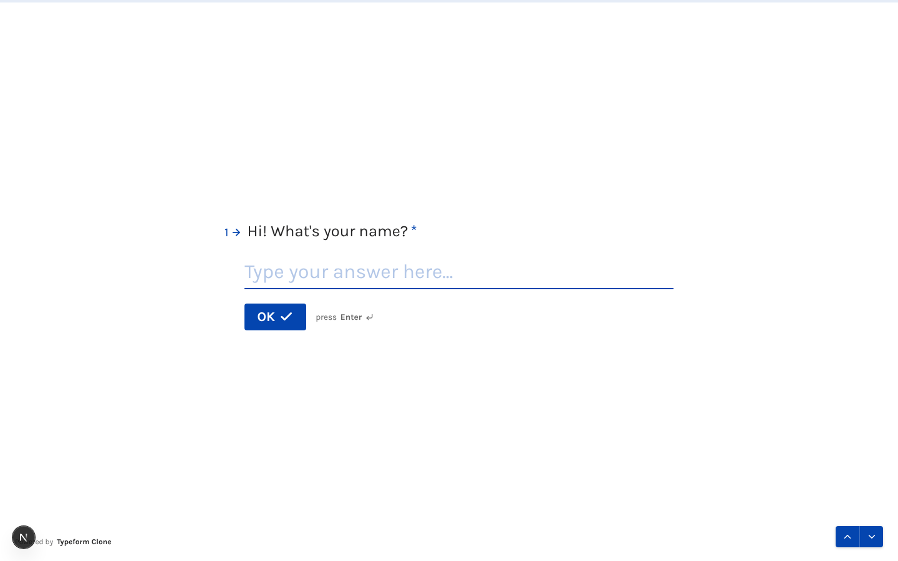
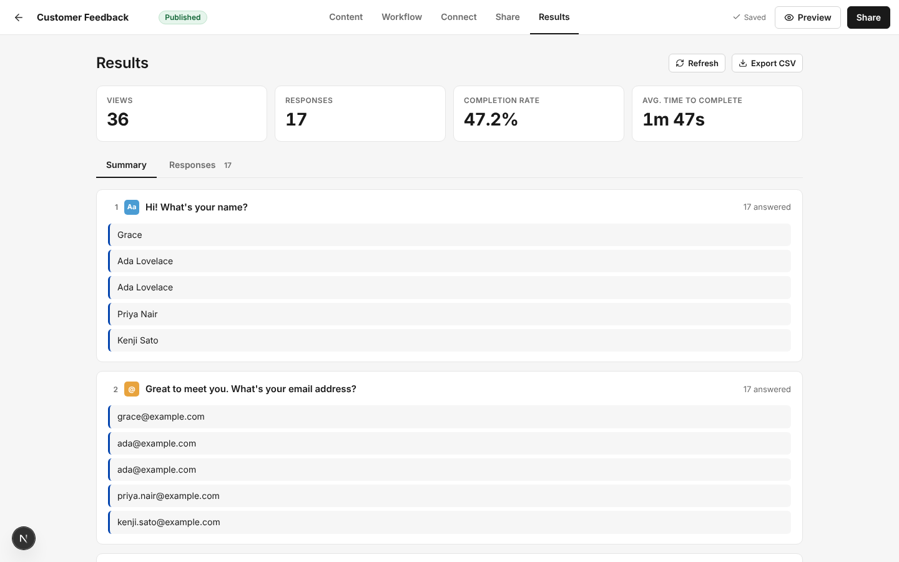

# Typeform Clone

A working clone of Typeform's **form builder**, **one-question-at-a-time respondent experience** and **results dashboard**.

| Layer    | Technology |
|----------|------------|
| Frontend | Next.js 15 (App Router) · React 19 · TypeScript 5 · `@dnd-kit` (drag & drop) · `zustand` (builder state) · plain CSS |
| Backend  | Python **3.13** · FastAPI · SQLAlchemy 2 · Pydantic 2 |
| Database | SQLite (file `backend/typeform_clone.db`, created automatically) |

> "Typeform Clone" is an educational project. It is not affiliated with Typeform; no Typeform logos, fonts or source code are used
> (fonts are the open-source Karla / Inter families, icons come from Lucide).

| Workspace | Builder |
|---|---|
|  |  |
| **Respondent player** | **Results** |
|  |  |

---

## 1. Quick start (TL;DR)

You need **Python 3.13.x** and **Node.js 20 or 22 (LTS)**. Open **two terminals**.

**Terminal 1 — backend** (from the project root)

```bash
cd backend
python -m venv .venv                       # Windows: py -3.13 -m venv .venv
source .venv/bin/activate                  # Windows PowerShell: .\.venv\Scripts\Activate.ps1   |  cmd: .venv\Scripts\activate.bat
python -m pip install --upgrade pip
pip install -r requirements.txt
uvicorn app.main:app --reload --port 8000
```

**Terminal 2 — frontend**

```bash
cd frontend
npm install
npm run dev
```

Open **http://localhost:3000**, then **Sign up** (or log in with the demo account `creator@example.com` / `demo1234`). The first start creates the database and loads a demo form with 14 sample responses.

Full, step-by-step instructions (with Windows specifics and troubleshooting) are in [section 2](#2-detailed-setup).

---

## 2. Detailed setup

### 2.1 Prerequisites

| Tool | Version | Check with |
|------|---------|------------|
| Python | 3.13.x (developed against 3.13) | `python --version` (Windows: `py -3.13 --version`) |
| Node.js | 20 LTS or 22 LTS (≥ 18.18 works) | `node --version` |
| npm | comes with Node | `npm --version` |

No database server, Redis or Docker is needed — SQLite ships with Python.

### 2.2 Backend

All Python dependencies are **pinned** in `backend/requirements.txt` and were verified to install from **pre-built wheels on Python 3.13**
(no C compiler / Visual Studio Build Tools needed). `backend/requirements.lock.txt` lists the exact full set that was tested, including transitive packages.

1. Go to the backend folder

   ```bash
   cd backend
   ```

2. Create a virtual environment (keeps these packages away from your global Python)

   | OS / shell | Command |
   |---|---|
   | Windows (recommended) | `py -3.13 -m venv .venv` |
   | Windows (if `py` is missing) | `python -m venv .venv` |
   | macOS / Linux | `python3.13 -m venv .venv` (or `python3 -m venv .venv`) |

3. Activate it

   | OS / shell | Command |
   |---|---|
   | Windows PowerShell | `.\.venv\Scripts\Activate.ps1` |
   | Windows cmd | `.venv\Scripts\activate.bat` |
   | macOS / Linux | `source .venv/bin/activate` |

   You should see `(.venv)` in your prompt.
   *PowerShell says "running scripts is disabled"?* Run `Set-ExecutionPolicy -Scope Process -ExecutionPolicy RemoteSigned` once in that window, then activate again.

4. Install dependencies

   ```bash
   python -m pip install --upgrade pip
   pip install -r requirements.txt
   ```

   (For a byte-for-byte reproducible install use `pip install -r requirements.lock.txt` instead.)

5. Run the automated tests (optional but recommended — 35 tests, ~5 s, uses a throw-away database)

   ```bash
   python -m pytest
   ```

6. Start the API

   ```bash
   uvicorn app.main:app --reload --port 8000
   ```

   * API: http://localhost:8000 · health check: http://localhost:8000/api/health
   * Interactive API docs (Swagger UI): **http://localhost:8000/docs**
   * On first start the tables are created and demo data is seeded (see [2.4](#24-demo-data--resetting)).

### 2.3 Frontend

1. In a **second terminal**

   ```bash
   cd frontend
   npm install          # or: npm ci   (exact versions from package-lock.json)
   ```

2. (Optional) point the UI at a different API URL. `frontend/.env.local` already contains the default:

   ```env
   NEXT_PUBLIC_API_URL=http://localhost:8000
   ```

   `.env.local.example` is a template if the file is missing. **Restart `npm run dev` after changing it** — `NEXT_PUBLIC_*` values are baked in at start/build time.

3. Run

   ```bash
   npm run dev          # development, http://localhost:3000
   ```

   Production build (optional): `npm run build && npm run start`.
   Type-check only: `npm run typecheck`.

### 2.4 Demo data & resetting

On the very first start (empty database) the backend creates a **demo account — `creator@example.com` / `demo1234`** — and two forms for it:

* **Customer Feedback** — *published*, 8 questions of every flavour, a welcome screen, one logic jump ("Would you recommend us? → Yes skips the follow-up") and 14 sample responses.
* **Event Registration** — a *draft* with 3 questions.

To start from a clean slate stop the backend, delete `backend/typeform_clone.db*` and start it again (it re-seeds). To start with an **empty** workspace set `SEED_DEMO=0` before launching:

```bash
# macOS/Linux                         # Windows PowerShell
SEED_DEMO=0 uvicorn app.main:app      # $env:SEED_DEMO="0"; uvicorn app.main:app
```

### 2.5 Configuration

| Variable | Where | Default | Purpose |
|---|---|---|---|
| `DATABASE_URL` | backend | `sqlite:///backend/typeform_clone.db` | SQLAlchemy URL |
| `CORS_ORIGINS` | backend | `http://localhost:3000,http://127.0.0.1:3000` | Comma-separated allowed browser origins |
| `SEED_DEMO` | backend | `1` | `0` = don't create the demo account / data |
| `SECRET_KEY` | backend | dev placeholder | Signs login tokens. **Set your own** for anything beyond local use: `python -c "import secrets; print(secrets.token_urlsafe(48))"` |
| `TOKEN_EXPIRE_DAYS` | backend | `7` | How long a login stays valid |
| `PASSWORD_ITERATIONS` | backend | `600000` | PBKDF2 work factor for password hashing |
| `UPLOAD_DIR` | backend | `backend/uploads` | Where uploaded files / background images are stored |
| `MAX_UPLOAD_MB` | backend | `25` | Hard cap for one uploaded file (per-question limit is 1..25) |
| `MAX_BACKGROUND_MB` | backend | `5` | Cap for a form background image |
| `NEXT_PUBLIC_API_URL` | frontend | `http://localhost:8000` | Where the browser sends API calls |

### 2.6 Troubleshooting

| Symptom | Fix |
|---|---|
| Workspace shows "Can't reach the server" | Backend isn't running or runs on another port → start it, or fix `NEXT_PUBLIC_API_URL` and restart `npm run dev`. |
| Browser console: CORS error | Open the app on `http://localhost:3000` or `http://127.0.0.1:3000`, or add your origin to `CORS_ORIGINS`. |
| `pip` tries to compile something / "Microsoft Visual C++ 14.0 required" | You are not on Python 3.13 (or pip is outdated). Run `python --version`, then `python -m pip install --upgrade pip`, recreate the venv. |
| `ModuleNotFoundError: No module named 'fastapi'` | The venv isn't active — activate it (step 3) and run `uvicorn` from `backend/`. |
| Port 8000 / 3000 already in use | Use another port: `uvicorn app.main:app --port 8001` (and set `NEXT_PUBLIC_API_URL=http://localhost:8001`), `npx next dev -p 3001`. |
| `npm install` fails on an old Node | Upgrade to Node 20/22 LTS. |
| Logged out unexpectedly / `401 Please log in` | The token expired or `SECRET_KEY` changed → log in again. |
| Database from an older version (no login) | Just start the new backend: it adds the missing `password_hash` column itself, and the old forms belong to `creator@example.com` (password `demo1234`). |
| Public link opens a "form isn't available" page | The form is a draft/unpublished — publish it from the builder first. |

---

## 3. Using the app

0. **Sign up / Log in (`/signup`, `/login`)** — email + password accounts. Every creator page needs a login (visitors are redirected to `/login` and sent back afterwards); each user only sees their own forms and results. The avatar menu in the workspace header has **Log out**. Respondents never need an account.
1. **Workspace (`/`)** — list of your forms with status (Draft / Published / Unpublished edits) and response counts. Create, rename, duplicate, publish/unpublish, copy link, delete — all from the row menu. Search and sort at the top.
2. **Builder (`/forms/:id/edit`)**
   * Left: outline. **Drag the ⋮⋮ handle** to reorder, **Add content** to open the question-type picker, row menu for duplicate/delete.
   * Centre: WYSIWYG canvas — click the title/description/choices and type. Desktop/mobile toggle.
   * Right: settings for the selected item (type, *Required*, multiple selection, rating steps/shape, number min/max, max characters, placeholder) and the **Design** tab (6 themes, fonts, colours, progress bar, question numbers).
   * Top: *Preview* (runs the **draft** in the real player), *Publish / Publish changes / Share*, autosave indicator.
   * Tabs: **Content**, **Workflow** (logic jumps), **Connect** (placeholders), **Share** (link + publish control), **Results**.
3. **Respondent (`/to/:publicId`)** — public, no login. Typeform-style conversation, see below.
4. **Results (`/forms/:id/results`)** — insight cards (views, responses, completion rate, average time), a **Summary** tab (bars per choice, rating average, number stats, latest text answers), a **Responses** table (paginated), a slide-over drawer for a single response (prev/next/delete) and **CSV export**. It polls every 15 s so new submissions appear on their own.

### Keyboard shortcuts in the respondent player

| Key | Action |
|---|---|
| `Enter` | Validate and go to the next question (`Shift+Enter` = new line in long text) |
| `↓` / `↑` | Next / previous question (not inside a long-text box, where they move the cursor) |
| `A`, `B`, `C`… | Pick a choice (toggles in multi-select) |
| `Y` / `N` | Yes / No |
| `1`–`9`, `0` | Rating (0 = 10) |
| `Esc` | Close the preview overlay |

---

## 4. Architecture overview

```
┌──────────────────────────── Browser (Next.js, TypeScript) ────────────────────────────┐
│  /login /signup     Auth pages           – AuthProvider (token in localStorage)       │
│  /                  Workspace            – forms CRUD                                   │
│  /forms/:id/*       Builder shell        – zustand store · optimistic edits · autosave  │
│        edit         Outline | Canvas | Settings   (dnd-kit)                             │
│        workflow     Logic jumps          share · connect · results                      │
│  /to/:publicId      Respondent player    – state machine, transitions, validation       │
└───────────────────────────────────────┬────────────────────────────────────────────────┘
                                         │ JSON over HTTP (fetch)
┌────────────────────────────────────────▼───────────────────────────────────────────────┐
│ FastAPI                                                                                 │
│   routers/auth.py       sign up · log in · me      security.py   PBKDF2 hashing + JWT   │
│   deps.py               current_user dependency (401 without a valid token)             │
│   routers/forms.py      forms CRUD · duplicate · publish / unpublish · draft preview    │
│   routers/questions.py  question + choice edits · reorder · logic (command layer)       │
│   routers/public.py     published form for respondents · response submission            │
│   routers/results.py    responses table · single response · summary stats · CSV         │
│   logic.py              branching engine           validation.py   per-type validators  │
│   submission.py         replays the flow server-side services.py  snapshot / publish    │
└────────────────────────────────────────┬───────────────────────────────────────────────┘
                                          │ SQLAlchemy 2
                                      SQLite file
```

Key ideas (taken from the two study documents and adapted to this scope):

* **Form-as-data.** A form is rows (questions, choices, logic rules) — never generated HTML. The builder edits it; the player *interprets* it.
* **Draft vs published.** Everything the builder does edits the *draft* (the `questions` / `choices` / `logic_rules` tables). **Publish** validates the draft, freezes it as an **immutable JSON snapshot** in `form_revisions`, and flips `forms.status`. The public link `/to/<public_id>` always serves the newest revision, so creators can keep editing without touching what respondents see; the UI shows **Unpublished edits → Publish changes**. Responses record the `revision_id` they were answered against and copy the question title/type into each answer, so old responses stay readable after edits/deletions.
* **Builder state & autosave.** `frontend/src/lib/store.ts` applies every edit optimistically, debounces text edits (600 ms) and pushes **all writes through one serial queue** so requests can never race. Structural edits (add / delete / duplicate / reorder) flush pending edits first. While dragging, only transient UI state changes — **one** `PUT …/questions/order` is sent on drop.
* **Respondent runtime = state machine.** `FormRuntime.tsx` keeps *navigation state* (current screen, history, answers) separate from *animation state* (screens that are still leaving). The logical screen changes immediately; the old screen is kept only until its exit animation fires `animationend` (one safety timer as a fallback), and `prefers-reduced-motion` skips animation altogether. Auto-advance (single choice, rating, dropdown, yes/no) uses a short delay after the pick.
* **Validation in layers.** The client (`lib/validation.ts`) gives instant feedback; the server (`validation.py`) is authoritative. On submit the server **replays the branching** (`submission.py`) so only questions the respondent actually saw are validated/stored, and errors come back per question — the player jumps to the first rejected one.
* **Branching.** Rules per source question: `operator + value → destination (question | end)`, evaluated top-to-bottom, first match wins, otherwise continue. Jumps are **forward-only** (prevents infinite loops); reordering or deleting questions automatically removes rules that would become invalid. The same algorithm lives in `backend/app/logic.py` and `frontend/src/lib/logic.ts`.
* **Authentication.** Email + password. Passwords are hashed with PBKDF2-HMAC-SHA256 (standard library, 600k iterations, per-user salt; `security.py`). Logging in or signing up returns a signed **JWT** (HS256, 7 days) which the frontend keeps in `localStorage` and sends as `Authorization: Bearer …` (`lib/api.ts`). The `current_user` dependency guards every creator endpoint and `get_form_or_404(db, id, user)` makes another user's form indistinguishable from a missing one (404). Public respondent endpoints stay anonymous. On the client `AuthProvider` + `RequireAuth` protect the pages, and any `401` clears the token and bounces to `/login`. Login errors are deliberately generic ("Incorrect email or password").
* **Idempotent submit.** The player sends a per-session `idempotency_key`; a retried or double-clicked POST returns the first response instead of creating a duplicate (unique constraint on `(form_id, idempotency_key)`).

### Where the two study documents disagreed — and what was built

| Topic | Study A (`Typeform_Technical_Study`) | Study B (`A–Z technical study`) | Decision |
|---|---|---|---|
| Question transition | `translateY(-100%)`, 0.6 s, `cubic-bezier(.25,1,.5,1)`, both screens `all` | ±12–18 px, 220/280 ms, separate exit & enter keyframes, transform+opacity only, honour reduced motion, don't drive navigation with timers | Hybrid: **overlapping exit/enter** (B), animating only `transform`/`opacity` (B), **A's easing & 0.6 s enter**, a mid-size shift (`clamp(56px,14vh,140px)`) so it reads as a vertical scroll like the real product, `animationend` instead of timers + reduced-motion support (B). |
| Progress bar | `index / total × 100 %`, `width 0.3s ease-out` | not specified | Typeform's own help centre describes a thin line at the **top** of the form that fills as you answer; implemented with A's formula and transition. Counts only the questions on the path actually walked. |
| Persistence model | one JSON schema in state | draft + immutable revisions + publish pointer | **B's model** (more realistic, enables safe editing of live forms). |
| Stack suggestions | Postgres/Redis/CDN | same | Out of scope: the brief requires SQLite; the architecture keeps those seams (revision snapshot = cache-friendly document). |
| Keyboard | Enter / letters | + accessibility rules (Enter only when unambiguous, focus kept after error) | Both; plus ↑/↓ navigation, Y/N and number shortcuts. |
| Logic | evaluated client-side | server should reproduce it | Both: client for instant jumps, server replays for authority. |
| Concurrency | – | version/ETag for drafts | Last-write-wins, but every edit bumps `draft_version`; adding an `expected_version` check is a small change (see *Known limits*). |

Things neither document specified were taken from Typeform's public behaviour: validation copy ("Please fill this in", "Hmm... that email address looks invalid"), choices keyed A/B/C, numbered "1 →" prefix, `OK ✓` button with "press Enter ↵", Welcome / Ending screens, Karla as the default font, and the Content / Workflow / Connect / Share / Results builder tabs.

---

## 5. Database schema

SQLite, defined in `backend/app/models.py` (SQLAlchemy). Foreign keys are enforced (`PRAGMA foreign_keys=ON`) and deletes cascade.

```
users 1──< forms 1──< questions 1──< choices
                 │            └──< logic_rules >── (destination) questions
                 ├──< form_revisions
                 └──< responses 1──< answers
```

| Table | Columns (key ones) | Notes |
|---|---|---|
| **users** | `id` PK, `name`, `email` UNIQUE (stored lower-case), `password_hash` (`pbkdf2_sha256$iterations$salt$hash`), `created_at` | Owner of forms. |
| **forms** | `id` PK, `public_id` UNIQUE (8-char random, used in `/to/<id>`), `owner_id` FK→users, `title`, `status` (`draft`\|`published`), `theme` JSON, `settings` JSON (progress bar, numbering, welcome, ending), `draft_version`, `published_draft_version`, `view_count`, `created_at`, `updated_at`, `published_at` | `has_unpublished_changes = status='published' AND draft_version ≠ published_draft_version`. |
| **questions** | `id` PK, `ref` UNIQUE (stable id used in revisions/answers), `form_id` FK, `position`, `type`, `title`, `description`, `required`, `properties` JSON, `created_at` · index `(form_id, position)` | `type` ∈ `short_text, long_text, multiple_choice, dropdown, email, number, yes_no, rating`. `properties` holds type-specific settings (rating `steps`/`shape`, number `min`/`max`, `allow_multiple`, `max_length`, `placeholder`, file `max_size_mb`). |
| **choices** | `id` PK, `question_id` FK, `position`, `label` | For `multiple_choice` and `dropdown`. |
| **logic_rules** | `id` PK, `form_id` FK, `source_question_id` FK, `position`, `operator`, `value`, `destination_type` (`question`\|`end`), `destination_question_id` FK (nullable) | `operator` ∈ `equals, not_equals, contains, greater_than, less_than, is_answered, always`. |
| **form_revisions** | `id` PK, `form_id` FK, `version`, `draft_version`, `document` JSON, `created_at` · UNIQUE `(form_id, version)` | Immutable snapshot created on every publish; the live form is the newest revision of a published form. |
| **responses** | `id` PK, `token` UNIQUE (`resp_…`), `form_id` FK, `revision_id` FK (SET NULL), `status`, `started_at`, `submitted_at`, `duration_seconds`, `idempotency_key`, `user_agent` · index `(form_id, submitted_at)` · UNIQUE `(form_id, idempotency_key)` | One row per respondent: `status` is `completed` or `partial` (started, not finished). |
| **uploads** | `id` PK, `token`, `form_id` FK, `response_id` FK (nullable until submitted), `question_ref`, `kind` (`answer`\|`background`), `filename`, `size`, `path` | Files live in `UPLOAD_DIR` under random names; removed with their response / form. |
| **custom_themes** | `id` PK, `owner_id` FK, `name`, `theme` JSON | Saved "My themes". |
| **answers** | `id` PK, `response_id` FK, `question_ref`, `question_type`, `question_title`, `value` JSON · UNIQUE `(response_id, question_ref)` · index `question_ref` | Title/type are **copied** at submit time. `value` is typed JSON: string · number · boolean · list of strings · null (shown but skipped). Questions not on the respondent's branch have no row. |

---

## 6. API overview

Base URL `http://localhost:8000`. Full interactive documentation: **`/docs`** (Swagger) and `/openapi.json`.
Creator endpoints need `Authorization: Bearer <token>` (get one from `/api/auth/login`; in Swagger click **Authorize**). Public endpoints need no authentication.
Errors: `{"detail": "message"}` or, for validation, `{"detail": {"message": "…", "errors": [{"ref": "q_…", "message": "…"}]}}` (HTTP 422).

### Auth

| Method & path | Purpose |
|---|---|
| `POST /api/auth/signup` `{name, email, password}` | Create an account (password ≥ 8 chars). → `201 {token, user}`; `409` if the email exists |
| `POST /api/auth/login` `{email, password}` | → `200 {token, user}`; `401 "Incorrect email or password"` |
| `GET /api/auth/me` | The logged-in user (`401` if the token is missing/expired) |

### Forms (creator)

| Method & path | Purpose |
|---|---|
| `GET /api/forms` | List forms: status, `response_count`, `question_count`, `has_unpublished_changes` |
| `POST /api/forms` `{title}` | Create (starts with one empty short-text question) |
| `GET /api/forms/{id}` | Full draft: theme, settings, questions (+choices), logic rules |
| `PATCH /api/forms/{id}` `{title?, theme?, settings?}` | Rename / theme / settings (thank-you & welcome screens, progress bar…) |
| `DELETE /api/forms/{id}` | Delete form with all questions, revisions, responses |
| `POST /api/forms/{id}/duplicate` | Copy questions, choices, logic, theme (no responses) → new draft |
| `POST /api/forms/{id}/publish` | Validate → snapshot revision → `status=published` (422 with a list of problems if invalid) |
| `POST /api/forms/{id}/unpublish` | Close the public link (revisions & responses kept) |
| `GET /api/forms/{id}/preview` | The **draft** in public-runtime shape |

### Questions & logic (builder commands)

| Method & path | Purpose |
|---|---|
| `POST /api/forms/{id}/questions` `{type, after_id?}` | Add (default choices/props per type) → returns the form |
| `PATCH /api/forms/{id}/questions/{qid}` `{type?, title?, description?, required?, properties?, choices?}` | Edit; `choices` is the full ordered list `[{id?, label}]`; changing `type` resets incompatible data |
| `DELETE /api/forms/{id}/questions/{qid}` | Delete (also removes rules that reference it) |
| `POST /api/forms/{id}/questions/{qid}/duplicate` | Duplicate right below |
| `PUT /api/forms/{id}/questions/order` `{question_ids:[…]}` | Reorder (must be a permutation); drops now-invalid backward jumps |
| `PUT /api/forms/{id}/logic` `{rules:[…]}` | Replace all logic rules (validated: forward-only, operator/type compatible) |

### Respondent (public)

| Method & path | Purpose |
|---|---|
| `GET /api/public/forms/{public_id}` | Published snapshot (404 if unpublished). Counts a view; add `?track=false` to skip. |
| `POST /api/public/forms/{public_id}/progress` | Save a **partial** response (same `idempotency_key` as the final submit); the final submit upgrades it to completed. Ignored once completed. |
| `POST /api/public/forms/{public_id}/upload?ref=&filename=` | File-upload answer (raw request body). → `201 {file_id,name,size}`; `413` over the question's limit |
| `DELETE /api/public/forms/{public_id}/upload/{file_id}` | Discard a not-yet-submitted file |
| `GET /api/public/assets/{token}` | Public background image |
| `POST /api/public/forms/{public_id}/responses` | Submit. Body below. 201 on success; 422 per-question errors |

```jsonc
// POST /api/public/forms/AbC123xy/responses
{
  "answers": [
    { "ref": "q_1a2b3c4d5e", "value": "Ada" },                 // text / email / dropdown / single choice
    { "ref": "q_2b3c4d5e6f", "value": ["Backend", "Design"] }, // multi-select
    { "ref": "q_3c4d5e6f7a", "value": 4 },                     // rating / number
    { "ref": "q_4d5e6f7a8b", "value": true }                   // yes/no
  ],
  "started_at": "2026-10-09T09:00:00Z",   // optional, used for "time to complete"
  "idempotency_key": "uuid-per-session"   // optional, makes retries safe
}
// → 201 { "response_id": "resp_9f2c…", "submitted_at": "2026-10-09T09:01:12Z" }
// → 422 { "detail": { "message": "Some answers need your attention",
//                     "errors": [ { "ref": "q_2b3c4d5e6f", "message": "Hmm... that email address looks invalid" } ] } }
```

### Results (creator)

| Method & path | Purpose |
|---|---|
| `GET /api/forms/{id}/responses?page=1&page_size=25` | Paginated table (`items`, `total`, `columns`) |
| `GET /api/forms/{id}/responses/{rid}` | One response in full |
| `DELETE /api/forms/{id}/responses/{rid}` | Delete a response |
| `GET /api/forms/{id}/summary` | Views, responses, completion rate, average time + per-question stats (option counts/percentages, rating average, number min/max/avg/median, latest text answers) |
| `GET /api/forms/{id}/responses.csv` | CSV export (adds a Status column; file answers show the file name) |
| `GET /api/forms/{id}/files/{file_id}` | Download an uploaded file (owner only) |
| `POST /api/forms/{id}/background` | Upload a background image (png/jpeg/gif/webp, ≤ 5 MB) |
| `GET/POST /api/themes`, `DELETE /api/themes/{id}` | Saved custom themes ("My themes", max 30 per user) |

`responses` accepts `?status=all|completed|partial`. **Completion rate = completed ÷ (completed + partial)**, i.e. submissions ÷ starts; per-question drop-off is computed by replaying branching. For partial rows `submitted_at` means "last activity".

---

## 7. Project structure

```
typeform-clone/
├── README.md
├── docs/screenshots/
├── backend/
│   ├── requirements.txt            # pinned, wheel-only on Python 3.13
│   ├── requirements.lock.txt       # exact tested set incl. transitive deps
│   ├── pytest.ini
│   ├── app/
│   │   ├── main.py                 # app, CORS, startup (create tables + seed)
│   │   ├── config.py database.py models.py schemas.py constants.py
│   │   ├── security.py             # password hashing + JWT
│   │   ├── deps.py                 # current_user dependency
│   │   ├── services.py             # serialisation, snapshot, publish checks
│   │   ├── logic.py                # branching engine
│   │   ├── validation.py           # authoritative answer validation
│   │   ├── submission.py           # replay flow → validated answers
│   │   ├── seed.py                 # first-run demo data
│   │   └── routers/ auth.py forms.py questions.py public.py results.py
│   └── tests/                      # 35 API tests (pytest)
└── frontend/
    ├── package.json  package-lock.json  tsconfig.json  next.config.mjs
    └── src/
        ├── app/                    # routes: /, /login, /signup, /forms/[id]/{edit,workflow,connect,share,results}, /to/[publicId]
        ├── components/
        │   ├── runtime/            # FormRuntime (player), AnswerInputs
        │   ├── builder/            # QuestionList (dnd), Canvas, SettingsPanel, AddContentModal, ShareModal, PreviewOverlay
        │   ├── auth/               # AuthProvider, RequireAuth, AuthForm, UserMenu
        │   ├── results/            # Summary, ResponseDrawer
        │   └── ui.tsx              # Modal, Toasts, Switch, Menu, …
        ├── lib/                    # api · auth · store · logic · validation · types · theme · questionTypes
        └── styles/                 # globals · dashboard · builder · runtime · results · auth
```

---

## 8. What is covered

| Requirement | Where |
|---|---|
| Form builder: title, ordered questions, add / edit / **drag-and-drop reorder** / delete | Builder → outline + canvas |
| Types: short text, long text, multiple choice, dropdown, email, number, yes/no, rating | all 8, with per-type settings |
| Per-question required toggle + description/help text | Settings panel + canvas |
| Live preview | WYSIWYG canvas (desktop/mobile) + full-screen **Preview** of the draft in the real player |
| Forms CRUD, status, response count, rename, duplicate, delete, publish/unpublish, shareable link, persistence | Workspace + Share tab; SQLite |
| One-question-at-a-time full-screen player with smooth transitions, keyboard nav, progress indicator | `/to/:publicId` |
| Client **and** server validation; thank-you screen; no login for respondents | `validation.ts` / `validation.py`, editable ending screen |
| Responses table, single response, per-question stats, persistence | Results tab |
| Toasts, modals, inline editing, settings (theme, thank-you screen) | all functional rather than placeholders |
| Creator authentication (sign up / log in / log out, per-user forms) | `/signup`, `/login`, `routers/auth.py` |
| **Bonus** basic branching | Workflow tab |
| Placeholders marked "Coming soon" | Integrations / webhooks, team collaboration, payment question type, QR code, embed, calculations |

## 9. Known limits / next steps

* **Auth is basic** — no email verification, password reset, rate-limiting of login attempts, or refresh tokens; the token lives in `localStorage` (an httpOnly cookie would be the hardening step). Set your own `SECRET_KEY` outside local use.
* **Last-write-wins** drafts. For multi-user editing, send `expected_draft_version` with edits and answer `409` on mismatch.
* Partial responses are saved on forward navigation / tab close; *views* are a simple counter on the public GET.
* Uploads are anonymous (no rate limiting or orphan-file cleanup); files are served as downloads only.
* Dark mode styles the app chrome (dashboard, builder, results); respondent forms use their own theme.
* Summary is computed in Python from the answers table — fine for thousands of responses; precompute/aggregate in SQL for more.
* Branching is forward-only and has no AND/OR groups, variables or scoring yet.
* Pixel-for-pixel identity with Typeform isn't claimed: layout, interaction patterns, copy and motion follow the real product, but its brand assets and proprietary typography are not reproduced.
